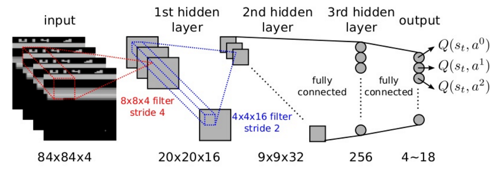
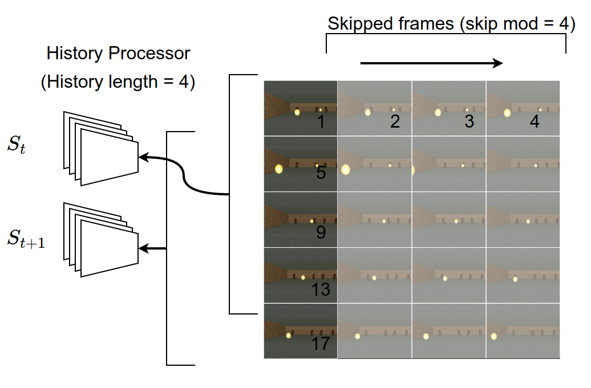

# Deep Reinforcement Learning
Deep reinforcement learning is a combination of deep learning and reinforcement learning. *It uses NN to substitute the policy function or value function in RL.*

## DQN Deep Q-Network: A close look
> DQN is a combination of Q-learning and CNN. It uses CNN to approximate the Q-value function.

DeepMind team created the Atari DQN work by using a combination of feature engineering and relying on deep neural network to achieve its results. The feature engineering included downsampling the image, reducing it to grey-scale and - importantly for the Markov Property - using four consecutive frames to represent a single state, so that information about velocity of objects was present in the state representation. The DNN then processed the images into higher-level features that could be used to make predictions about state values.

DeepMind used atari environment for DQN test, even through all the return `observation` for preprocessing:

### Preprocessing

- Observation
  1. rgb $\rightarrow$ gray, i.e. image shape (210,160,3)$\rightarrow$ (210,160)
  2. down sample: (210,160) $\rightarrow$ (110,84)
  3. crop: (110,84) $\rightarrow$ (84,84)
- Observation :arrow_right: state:
  1. 4 history frames to 1 $\rightarrow$ (84,84,4)

### CNN



- architecture
  - Conv2D: 32, 8x8, strides=4, input_shape=(84,84,4)
  - Conv2D: 64, 4x4, strides=2
  - Conv2D: 64, 3x3, strides=1
  - Dense: 256
  - Dens: outputshape

- comple
  - RMSProp

### Replay Buffer

- fix length
- every time feed: (state, action, reward, next_state, done)
- once reach L length: start training
- length: 1million

### Target model update

- every C step
- Epsilon: 1$\rightarrow$0.1 (1 million frame for total 50 milion)

### Frame skipping



[great explanation](https://danieltakeshi.github.io/2016/11/25/frame-skipping-and-preprocessing-for-deep-q-networks-on-atari-2600-games/)

- chose at kth frame
- last k-1 frame
- k=4

Speed up for atari, use `info['ale.lives'] < 5` for terminating the episode

### Clip

- reward: -1,0,1
- Error: $|Q(s,a,\theta)-Q(s',a',\theta^-)\le1$ 

NOTES:

change RMSprop parameter

```python
tf.keras.optimizers.RMSprop(
    learning_rate=0.00025,
    rho=0.9,
    momentum=0.95,
    epsilon=1e-07,
    centered=False,
    name="RMSprop",
    **kwargs
)
```

## Comparison with Other DRL algorithms

### Double DQN
- use target network to select the action
- use online network to evaluate the action
- evaluation network helps provide a less biased estimate of Q-values
- still limited to discrete action spaces

### A2C Advantage Actor-Critic
- use policy gradient to update the policy
- use value function to update the value
- actor learns to select actions while critic evaluates those actions
- can handle both continuous and discrete action spaces

### A3C Asynchronous Advantage Actor-Critic
- asynchronous version of A2C that runs multiple parallel agents
- each agent has its own copy of the environment and network
- periodically updates a global network with gathered experiences
- better exploration due to parallel agents

### TRPO Trust Region Policy Optimization
- uses KL divergence constraint to limit how much the policy can change in each update
- guarantees monotonic policy improvement (theoretically)
- requires computing second-order derivatives and conjugate gradient optimization
- generally more computationally expensive than PPO
- very stable training due to constrained updates

### PPO Proximal Policy Optimization
- policy gradient method that directly optimizes the policy
- uses "clipped" objective function to prevent too large policy updates
- generally more stable than older policy gradient methods
- works well for continuous and discrete actions
- simpler to implement than TRPO while maintaining good performance

### DDPG
- specifically designed for continuous action spaces
- combines ideas from DQN and actor-critic methods
- uses deterministic policy instead of stochastic
- adds noise to actions for exploration
- can be sensitive to hyperparameters and less stable than PPO

## What is Policy Gradient?
Policy Gradients is a fundamental approach in reinforcement learning that directly optimizes the policy without learning a value function.

- instead of learning Q-values, directly learn the policy π(a|s) that maps states to actions
- uses gradient ascent to maximize expected rewards
- the policy is typically represented by a neural network that outputs action probabilities
