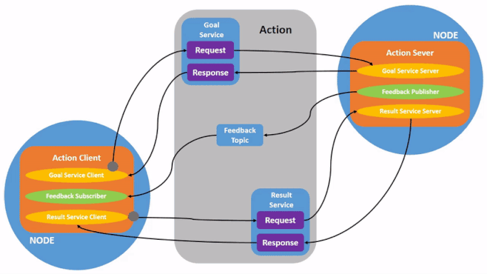
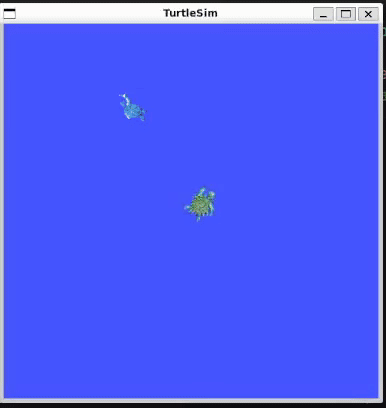

> Personally I have heard ROS since 2015 (wow TEN YEARS from now), but at that time the linux system is not very stable (I believe the popular version was Ubuntu14 or Ubuntu16) and I was struggling with other courses in Uni. So I did not have the chance to learn until now, but it's never too late to learn anything.

# What is ROS?
ROS is a flexible framework for writing robot software. It is a collection of tools, libraries, and conventions that aim to simplify the task of creating complex and robust robot behavior across a wide variety of robotic platforms.


# Installation
> We will use ROS2 here, since ROS2 is the latest version of ROS and it is more stable and more powerful than ROS1.

I tried both humble and jazzy, and found out that the new Gazebo is not easy to use intuitively, and there are less tutorials about that. So for Gazebo part, I use classic Gazebo and ros2 humble.

To be honest, the official website is way much better, so you may want to follow [this for jazzy](http://docs.ros.org/en/jazzy/Installation/Ubuntu-Install-Debs.html) and [this for humble](http://docs.ros.org/en/humble/Installation/Ubuntu-Install-Debs.html)

## Docker
> I wouldn't recommend using docker with Gazebo and rviz, from my experience so far, it's not stable enough or hard to make it correct.

There are some docker tutorials for humble and jazzy already:
- [Humble - Setup ROS 2 with VSCode and Docker [community-contributed]](https://docs.ros.org/en/humble/How-To-Guides/Setup-ROS-2-with-VSCode-and-Docker-Container.html)
- [Jazzy - Setup ROS 2 with VSCode and Docker [community-contributed]](https://docs.ros.org/en/jazzy/How-To-Guides/Setup-ROS-2-with-VSCode-and-Docker-Container.html)

I also attach my personal code for docker using `docker-compose.yaml`(Docker) and `devcontainer.json` (VSCode extension).

<details>
<summary>Humble Docker Set Up</summary>

```json
// devcontainer.json
{
  "name": "ROS 2 Development Container",
  "privileged": true,
  "remoteUser": "kristin",
  "dockerComposeFile": "docker-compose.yaml",
  "service": "devcontainer",
  "workspaceFolder": "/home/kristin/ros2_ws", // you should change to your own workspace
  "customizations": {
      "vscode": {
          "extensions": [
              "ms-vscode.cpptools-extension-pack",
              "twxs.cmake",
              "donjayamanne.python-extension-pack",
              "eamodio.gitlens",
              "ms-iot.vscode-ros",
              "ms-azuretools.vscode-docker",
              "ms-python.black-formatter",
              "smilerobotics.urdf",
              "redhat.vscode-xml"
          ]
      }
  },
  "postCreateCommand": "sudo rosdep update && sudo rosdep install --from-paths src --ignore-src -y && sudo chown -R $(whoami) /home/kristin/ros2_ws/" // you should change to your own workspace
}
```

```yaml
# ./devcontainer/docker-compose.yaml
services:
  devcontainer:
    build:
      context: .
      dockerfile: Dockerfile
      args:
        - USERNAME=kristin # you should change to your own username
    image: vac611/ros2_humble_gazebo:latest # you should change to your own image name
    container_name: vac611_ros2_humble_gazebo # you should change to your own container name
    volumes:
      - /home/kristin/ros2_ws:/home/kristin/ros2_ws:rw # you should change to your own workspace path
      - type: bind
        source: /tmp/.X11-unix
        target: /tmp/.X11-unix
        consistency: cached
      - type: bind
        source: /dev/dri
        target: /dev/dri
        consistency: cached
    command: sleep infinity
    network_mode: host
    pid: host
    ipc: host
    environment:
      - DISPLAY=unix:0
      - ROS_AUTOMATIC_DISCOVERY_RANGE=LOCALHOST
      - ROS_DOMAIN_ID=42
    privileged: true
```

</details>

<details>
<summary>Jazzy Docker Set Up</summary>

```json
// .devcontainer/devcontainer.json
{
    "name": "ROS 2 Development Container",
    "privileged": true,
    "remoteUser": "kristin",
    "dockerComposeFile": "docker-compose.yaml",
    "service": "devcontainer",
    "workspaceFolder": "/home/kristin/ros2_ws", // you should change to your own workspace path
    "customizations": {
        "vscode": {
            "extensions": [
                "ms-vscode.cpptools-extension-pack",
                "twxs.cmake",
                "donjayamanne.python-extension-pack",
                "eamodio.gitlens",
                "ms-iot.vscode-ros",
                "ms-azuretools.vscode-docker",
                "ms-python.black-formatter",
                "smilerobotics.urdf",
                "redhat.vscode-xml"
            ]
        }
    },
    "postCreateCommand": "sudo rosdep update && sudo rosdep install --from-paths src --ignore-src -y && sudo chown -R $(whoami) /home/kristin/ros2_ws/" // you should change to your own workspace path
}
```

```yaml
# .devcontainer/docker-compose.yaml
services:
  devcontainer:
    build:
      context: .
      dockerfile: Dockerfile
      args:
        - USERNAME=kristin # you should change to your own username
    image: vac611/ros2_jazzy_gazebo:latest # you should change to your own image name
    container_name: vac611_ros2_jazzy_gazebo # you should change to your own container name
    volumes:
      - /home/kristin/ros2_ws:/home/kristin/ros2_ws:rw # you should change to your own workspace path
      - type: bind
        source: /tmp/.X11-unix
        target: /tmp/.X11-unix
        consistency: cached
      - type: bind
        source: /dev/dri
        target: /dev/dri
        consistency: cached
    command: sleep infinity
    network_mode: host
    pid: host
    ipc: host
    environment:
      - DISPLAY=unix:0
      - ROS_AUTOMATIC_DISCOVERY_RANGE=LOCALHOST
      - ROS_DOMAIN_ID=42
    privileged: true
```
</details>

### Bashrc file set up
After installation, you need to set up the bashrc file to source the ros2 environment for autocompletion and other features.
```bash
# ~/.bashrc

# ros2
source /opt/ros/humble/setup.bash

# colcon
source /usr/share/colcon_cd/function/colcon_cd-argcomplete.bash

# ros2 workspace 
source ~/ros2_ws/install/setup.bash # you should change to your own workspace path

# gazebo
source /usr/share/gazebo/setup.bash

# nav2
export TURTLEBOT3_MODEL=waffle
export RMW_IMPLEMENTATION=rmw_cyclonedds_cpp # a fix
```

# ROS2 Basic Concepts

> You can find the [official explanation as a reference](https://wiki.ros.org/Nodes)

## Nodes
  - Node the a basic unit of computation in ROS. 
  - It needs to inherit from `rclcpp::Node` (c++) or `rclpy::Node` (python) and then you can use it to create a node.

## Topics
  - Topic can have multiple subscribers and publishers. 
  - A timer is usually set to publish data at a certain rate.

## Services
    
  

  - Service can have only one server but multiple clients.
  - It is triggered by a request and the response is sent back to the requesting client.

## Actions
  

  - Actions are like services that allow you to execute long running tasks, provide regular feedback, and are cancelable.
  - A robot system would likely use actions for navigation. An action goal could tell a robot to travel to a position. While the robot navigates to the position, it can send updates along the way (i.e. feedback), and then a final result message once it’s reached its destination.

## Parameters
  - Parameters are used to store and retrieve configuration data that is needed by nodes at runtime.
  - Can also save the parameter settings to a file to reload them in a future session.

# ROS Launch
Launch files in ROS are used to start multiple nodes and set parameters in a single command. It supports python and xml.

# Nav2
The official website is [here](https://docs.nav2.org/).

It provides navigation tools in Gazebo and rviz. You can play with it from [here](https://docs.nav2.org/getting_started/index.html#navigating), and navigate the turtlebot3 in Gazebo world environment.


# Moveit (TBC)


# ROS Demos
I made a few demos to learn ROS. You can find them in [My Github ROS Demo repo](https://github.com/Kexin-Wei/LearnROS).

## Turtlesim Chase Game
This demo only uses basic ROS concepts (node, topic, message, service, launch).
The src code in c++ and python is in package `src/turtle_control` in branch `ros_beginner`.
It requires `turtlesim` package.



## Turtlebot3 Navigation (TBC)
In this demo, I created a map using Gazebo. It has online models that we can easily drag inside Gazebo.
- map is in `maps/map_floor.yaml`, generated using `nav2_map_server` and rviz to save in slam.

