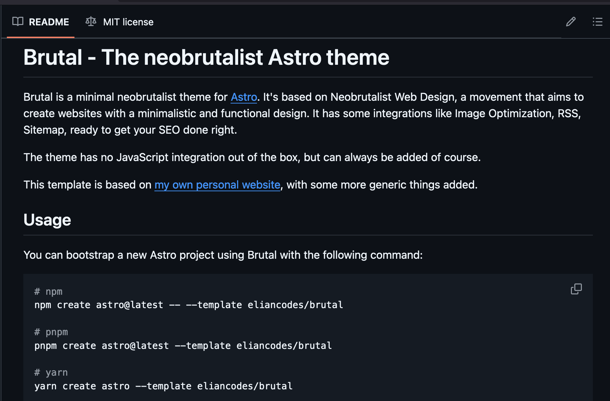

> I have tried so many personal website generators (Jekyll, Hugo, Hexo) and now is Astro. Web dev is developing so fast, and now there are tones of tools (literally) to learn. Hazy dizzy. Well, this is a new guide to set up a personal website based on Astro.

# Where to start?
The first step of learning everything today is simple - go to the [official website](https://docs.astro.build/en/getting-started/).

I would recommend to follow the [tutorial](https://docs.astro.build/en/tutorial/0-introduction/) without deploying to github first. Since apparently after this tutorial, your website is far from ready. You need to choose the right theme you want and redo the deploy again.

# Themes?
> I am a lazy person but want a beautiful blog look. So Theme is necessary for me. For hard-cored people, you can start your own theme I believe.

Astro has [a collection of themes](https://astro.build/themes/?search=&categories%5B%5D=blog&categories%5B%5D=portfolio) provided online.

Just choose the one you like, and you are right on the way to start.

Take [my theme](https://astro.build/themes/details/brutal/) as an example, follow the instructions in the github and your modification journey starts.

> You may need to replace a lot of links and text, and facing troubles with css or javaScript. But keep one thing in mind, GPTs and google (or perplexity you may prefer) are your good friend. And don't forget to search about related information in **Astro**.

# How to deploy?
> Since I use Github Page, the following guide only refers to the setting up about it. Astro has one for Netlify you may want to check that out.

## Set up git repo
Once your website is ready, set up it in github following this guide [GitHub Pages](https://docs.github.com/en/pages/quickstart). Basically just change the repo name to `username.github.io`, of course the `username` is your github user name.

## Get a domain and set it up
If you want to buy a domain, personally I use [GoDaddy](https://www.godaddy.com/en-sg).
you need to follow this [github setting guide](https://docs.github.com/en/pages/configuring-a-custom-domain-for-your-github-pages-site/managing-a-custom-domain-for-your-github-pages-site) to set up your domain host in the seller website, like GoDaddy in order to let github page go through.

After this step, you may have a `CNAME` file that is generated by Github, which will be used in the next step.

## Connect Astro deploy to Github Page
This is a easy part,  just follow this [Deploy your Astro Site to GitHub Pages](https://docs.astro.build/en/guides/deploy/github/) to add a workflow.

Your `CNAME` file may be not in the right place as Astro said, you can just move it to where it belongs. I never tried another place, maybe it still works. Do let me know :)

## Check your workflow (if needed)
You may want to see whether you page is deployed, then you can go to the **Action** under Github repo and click inside of each run to see what blocks it.

After this, your website should be ready to go, like mine [here](https://kexinwei.org).